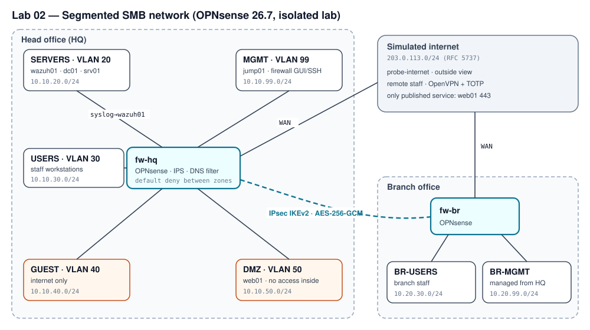

# Segmented SMB Network on OPNsense

> **TL;DR** — Design for a fictional 40-person company with a head office and a branch: five
> security zones behind a default-deny OPNsense firewall, Suricata IPS, DNS filtering, a certificate-based
> IPsec tunnel between sites, remote access with TOTP, and hardened administration. The firewall policy is
> written once as code and drives both the documentation and an automated, harmless reachability checker.
> **Deliverable: design, policy as code and tooling, ready to build; lab results not yet measured.**

| | |
|---|---|
| **Role played** | Network/security engineer for a 40-person company with two offices |
| **Environment** | Proxmox VE, two OPNsense 26.7 firewalls, VLAN-aware bridges, isolated lab |
| **Tools** | OPNsense, Suricata, Unbound, IPsec (IKEv2), OpenVPN, Python |
| **Deliverable** | Architecture, policy-as-code (56 flows to verify in the lab), configuration guides, unit-tested validation tooling |

---

## 1. Problem

- **Context:** a fictional professional-services company, 40 staff in three departments, a head office and
  one branch, and a public website. Today everything sits on one flat network.
- **Why it matters:** on a flat network one infected laptop can reach every server, the backups and the
  firewall's own admin page. Guests on the Wi-Fi share that network too.
- **Requirements:**
    1. Staff reach the internet and only the internal services they need.
    2. Guests reach only the internet.
    3. The website is the only service published to the internet (VPN endpoints aside).
    4. A compromised workstation or web server can't reach management interfaces or other zones.
    5. The branch uses head-office services over an encrypted tunnel; remote staff connect with MFA.
    6. Administration happens only from a dedicated network, with MFA, and every decision is logged centrally.
- **Constraints:** free and open-source tooling; isolated lab; addresses from private and documentation ranges.
- **Success criteria:** every flow in the policy behaves as designed when tested from inside each zone, and the
  manual checks (tunnel encryption, MFA, IPS, DNS filtering) pass.

## 2. Architecture

| Site | Zone | VLAN | Subnet | Purpose |
|---|---|---|---|---|
| HQ | SERVERS | 20 | 10.10.20.0/24 | Domain controller, Linux server, Wazuh SIEM (Lab 01) |
| HQ | USERS | 30 | 10.10.30.0/24 | Staff workstations |
| HQ | GUEST | 40 | 10.10.40.0/24 | Guest Wi-Fi, internet only |
| HQ | DMZ | 50 | 10.10.50.0/24 | Public web server, no access inside |
| HQ | MGMT | 99 | 10.10.99.0/24 | Firewall GUI/SSH and admin jump host |
| Branch | BR-USERS / BR-MGMT | 30 / 99 | 10.20.30.0/24, 10.20.99.0/24 | Branch staff and branch firewall management |
| — | WAN | — | 203.0.113.0/24 | Simulated internet (RFC 5737 documentation range) |

The full IP plan and every tested flow with its justification are generated from the policy:
[docs/ip-plan.md](docs/ip-plan.md) and [docs/rules.md](docs/rules.md).

| Decision | Alternatives considered | Why this one |
|---|---|---|
| OPNsense 26.7 | FortiGate-VM trial; pfSense CE | The free FortiGate-VM trial allows only 3 interfaces, 3 policies and 3 routes and has no FortiGuard updates; OPNsense has IPS, IPsec, OpenVPN and TOTP built in with no limits |
| Policy as code (YAML) | Rules documented by hand | One source for the rule tables and the tests, so documentation and validation can't drift |
| IPsec IKEv2 with certificates | Pre-shared key; WireGuard | Per-device identity and revocation; IKEv2 is what most corporate firewalls speak, so the design carries over |
| OpenVPN + TOTP | WireGuard | Built-in two-factor authentication on OPNsense; WireGuard has no native MFA |
| Domain clients resolve through dc01 → filtered firewall resolver | Clients use the firewall directly | Active Directory needs the domain controller for DNS; filtering still applies to every external name |

## 3. Build

Step-by-step guides for OPNsense 26.7 in [docs/opnsense/](docs/opnsense/):

1. [Install and interfaces](docs/opnsense/01-install-and-interfaces.md) — Proxmox bridges, VLANs, addressing.
2. [Firewall rules](docs/opnsense/02-firewall-rules.md) — aliases and one rule per allowed flow, explicit
   block-and-log at the end of each zone.
3. [NAT and egress](docs/opnsense/03-nat-and-egress.md) — one published service; servers and MGMT have no
   direct internet access.
4. [Suricata IPS](docs/opnsense/04-ips-suricata.md) — ET Open rules, drop only high-confidence signatures.
5. [DNS filtering](docs/opnsense/05-dns-filtering.md) — Unbound blocklists; clients can't bypass the resolver.
6. [Site-to-site IPsec](docs/opnsense/06-ipsec-site-to-site.md) — every parameter with its reason.
7. [OpenVPN + TOTP](docs/opnsense/07-openvpn-totp.md) — certificate + password + one-time code.
8. [Admin hardening](docs/opnsense/08-admin-hardening.md) — MGMT-only GUI/SSH, MFA, logs to Wazuh, encrypted
   backups.

## 4. Validation plan

- **Automated reachability check** ([docs/validation.md](docs/validation.md)): from a probe host in each zone,
  `python3 -m labtools.checker --zone <ZONE>` tests all 56 flows in the policy with ordinary TCP connections,
  UDP echoes and DNS queries to the lab's own hosts (internet-facing flows at the firewall's WAN address), and reports each as *PASS*, *FAIL (blocked)* or *FAIL (allowed)*.
- **Manual checks** ([tests/test-plan.md](tests/test-plan.md)): IPsec traffic is encrypted on the wire, VPN
  login fails without the TOTP code, the IPS raises an alert on a harmless test signature, blocked domains
  don't resolve, and a failed admin login reaches Wazuh.

## 5. Deliverables and measurement

**Delivered in this repository:**

- Architecture, zone design and IP plan for two sites.
- A policy matrix of 56 flows (including the full set of ports an Active Directory client needs), each with a
  written justification, validated in CI (unknown zones, same-zone
  flows, duplicates or missing justifications fail the build).
- Eight OPNsense configuration guides and a guide to publishing firewall configs without secrets.
- A reachability checker and target listener covered by an automated test suite (including real TCP/UDP
  probes), plus a CI check that the generated documentation matches the policy.

**How results are measured:**

| Metric | Definition |
|---|---|
| Policy conformance | Flows that behaved as designed ÷ flows tested, per zone and overall |
| Manual checks | Pass/fail for each check in the test plan |

## 6. Design lessons and roadmap

- **Check licence limits before choosing a product.** The FortiGate-VM trial looked like the obvious choice
  but couldn't hold even the basic zone design; checking first avoided building on a dead end.
- **Write the policy once.** Keeping zones and flows in one YAML file, with the docs and the checker generated
  from it, removes the usual drift between "what the diagram says" and "what the firewall does".
- **Test the denies, not just the allows.** A default-deny policy is only proven when blocked flows are tested
  from inside each zone; the policy lists them explicitly for that reason.
- **Probes need something to answer.** An allowed flow to a port with no service looks exactly like a blocked
  one, so the design includes a listener and marks hosts whose real services already answer.
- **Designing for real clients changes the details.** Domain-joined machines need the domain controller for
  DNS and Lab 01's agents need their own flows; both surfaced only when writing the step-by-step guides.

**Roadmap:** build both firewalls from the guides, run the checker from all six zones and the manual checks,
publish the measured conformance here, and later compare with a licensed FortiGate on the same policy.

## 7. Reproduce it yourself

- Clone: `git clone https://github.com/santorest/lab-02-segmented-network.git`
- Download bundle: from the portfolio site (SHA-256 shown next to the download).
- Estimated time: 1–2 days.
- Teardown: delete the VMs and bridges; no cloud resources are used.

## 8. Mapping

| Control | Framework | How this project addresses it |
|---|---|---|
| 13.4 Perform traffic filtering between network segments | CIS Controls v8 | Default-deny zone firewall with a justified, tested allow list |
| 12.2 Establish and maintain a secure network architecture | CIS Controls v8 | Segmented zones, DMZ, guest isolation, dedicated MGMT |
| 12.8 Establish and maintain dedicated computing resources for administrative work | CIS Controls v8 | MGMT zone and jump host; GUI/SSH bound to MGMT |
| 6.4 Require MFA for remote network access | CIS Controls v8 | OpenVPN with TOTP |
| 13.3 / 13.8 Deploy network intrusion detection / prevention | CIS Controls v8 | Suricata in IPS mode on WAN and the internal VLANs |
| PR.IR-01 Networks and environments are protected from unauthorized logical access | NIST CSF 2.0 | Zones, egress control, tested policy |

---

*All testing is performed in an isolated lab environment I own. No real organization's data, hostnames or
configurations are included.*
